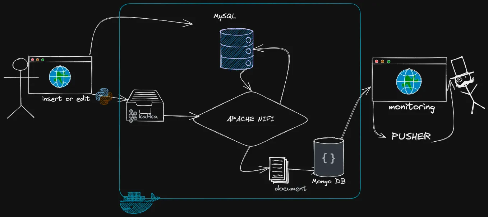
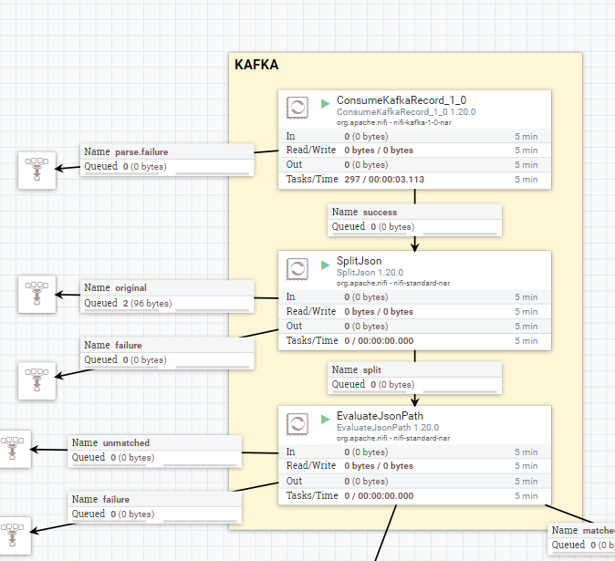
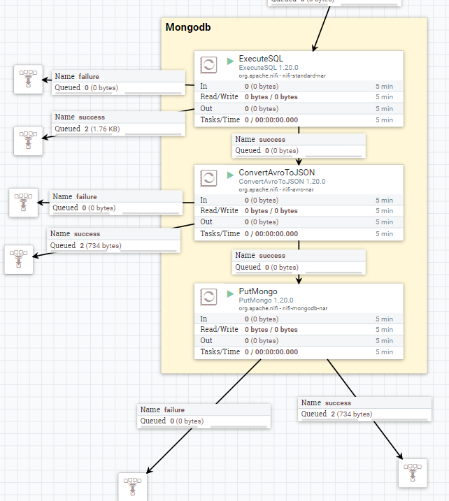
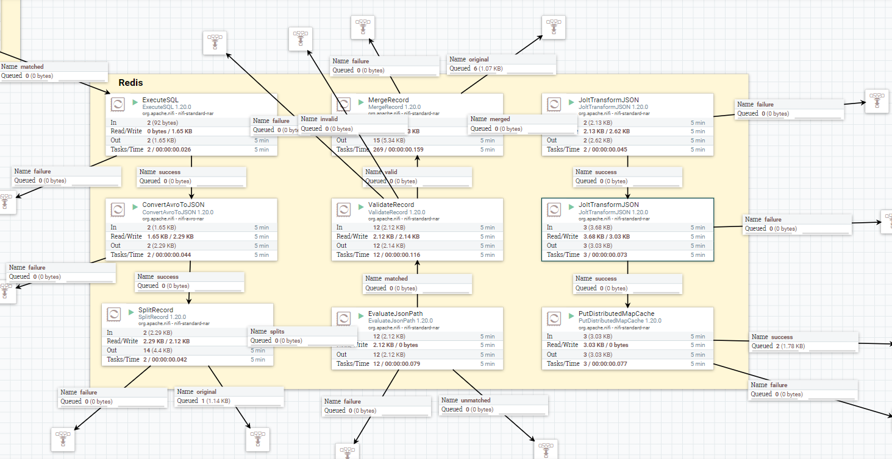

# ⚡ Système de Cache Distribué en Temps Réel

**Orchestration de données événementielle via Kafka, NiFi, Redis et MongoDB.**

_Une architecture découplée conçue pour résoudre les problèmes de latence des applications monolithiques grâce au traitement asynchrone et au cache haute performance._

 

 

[⬇️ Voir la Présentation Complète (PDF)](docs/presentation.pdf) · [🐛 Signaler un Bug](../../issues)

---

## 🚀 Problématique & Solution

[cite_start]Les applications monolithiques traditionnelles souffrent de **lenteurs** lorsqu'elles interrogent directement des bases de données volumineuses, impactant l'expérience utilisateur[cite: 21, 22].

**Notre solution :** Une architecture **EDA (Event-Driven Architecture)** qui sépare les opérations d'écriture et de lecture :
* [cite_start]🚀 **Cache Redis** : Pour un accès aux données en $O(1)$ (quelques millisecondes)[cite: 174].
* [cite_start]🗄️ **MongoDB (Replica Set)** : Pour l'historisation et la réactivité via les *Change Streams*[cite: 169].
* [cite_start]🔄 **Mise à jour Temps Réel** : L'interface utilisateur se met à jour instantanément sans rechargement[cite: 226].

---

## 🛠️ Architecture Technique (Workflow)

Le projet suit un pipeline de données en 5 phases distinctes :

### Phase 1 : Le Producteur (Laravel & Python)
* [cite_start]**Déclencheur :** Un `Observer` Laravel détecte la création d'une commande[cite: 56].
* [cite_start]**Action :** Exécution d'un script Python qui pousse les données (ID Client, ID Commande) dans un topic **Kafka**[cite: 57, 60].

### Phase 2 : Orchestration (Apache NiFi)
* [cite_start]**Ingestion :** NiFi consomme les messages du topic Kafka[cite: 138].
* [cite_start]**Routing :** Le flux est divisé en deux branches : une vers le cache (Redis), l'autre vers l'historique (MongoDB)[cite: 142].

### Phase 3 : Transformation (JOLT)
* [cite_start]Utilisation de processeurs **JoltTransformJSON** pour nettoyer les données[cite: 140].
* [cite_start]Stratégie **Shift & Remove** pour ne garder que les champs pertinents et optimiser l'empreinte mémoire[cite: 153].

### Phase 4 : Stockage Polyglotte
* [cite_start]**Redis :** Stockage Clé-Valeur pour les requêtes fréquentes (Clé : `customerNumber`)[cite: 173].
* [cite_start]**MongoDB :** Stockage persistant configuré en **Replica Set (rs0)** pour activer les fonctionnalités temps réel[cite: 169].

### Phase 5 : Diffusion Temps Réel (The Watcher)
* [cite_start]Un "Watcher" Laravel écoute les **Change Streams** de MongoDB[cite: 216].
* [cite_start]Diffusion de l'événement `NewOrder` vers le frontend via **Pusher (WebSockets)** pour une mise à jour immédiate du Dashboard manager[cite: 223, 225].

---

## 📸 Aperçu du Pipeline NiFi

  
  
<i>Transformation et routage des données dans Apache NiFi -1- Kafka</i>

  
  
<i>Transformation et routage des données dans Apache NiFi -2- Mongodb</i>

  
  
<i>Transformation et routage des données dans Apache NiFi -3- Redis</i>

---

## 💻 Stack Technologique

[cite_start]Le projet repose sur un cluster de conteneurs orchestré par **Docker Compose**[cite: 39].

| Catégorie | Technologies |
| :--- | :--- |
| **Backend App** | Laravel (PHP), Python Scripting |
| **Message Broker** | Apache Kafka, Zookeeper |
| **ETL / Orchestration** | Apache NiFi |
| **Bases de Données** | MySQL (Transactionnel), MongoDB (Historique), Redis (Cache) |
| **Temps Réel** | MongoDB Change Streams, Pusher, WebSockets |
| **Infrastructure** | Docker, Docker Compose |

---

## 👥 L'Équipe

Ce projet a été réalisé par :

* **Brahim DARGUI**
* **Mourad Benamre**
* **Mohamed Machlou**
* **Mounir Jaouhari**

---

## 📄 Documentation

Pour comprendre les choix architecturaux en détail, notamment la configuration des transformations JOLT et du Replica Set MongoDB :

> **👉 [Consultez le rapport de présentation (PDF)](docs/presentation.pdf)**

---

  <small>Projet Académique - Data Engineering & Architecture Distribuée</small>

